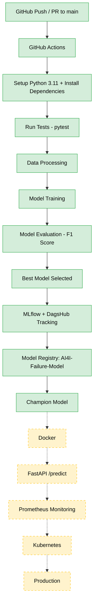

<div align="center">

# 🏭 Production-Ready MLOps Pipeline

**An end-to-end MLOps pipeline for predictive maintenance: from raw data to a registered, production-ready champion model.**

[](https://github.com/osamashabih6960/Production-Ready-MLOps-Pipeline/actions/workflows/mlops.yml)


</div>

---

## 📌 Overview

This project predicts **machine failure** on industrial equipment using the **AI4I 2020 Predictive Maintenance Dataset**. The focus is not only on the model, but on the full MLOps lifecycle around it:

- Reproducible data ingestion and preprocessing
- Automated model training, evaluation and best-model selection
- Experiment tracking with **MLflow** and **DagsHub**
- Dataset versioning with **DVC**
- Model governance through the **MLflow Model Registry** (`champion` alias)
- Automated testing and **CI/CD with GitHub Actions**
- Planned: **Docker → FastAPI → Prometheus → Kubernetes**

---

## 🔄 Pipeline Architecture



> ✅ Solid green = implemented  |  🟡 Dashed yellow = planned

---

## ✨ Key Features

| Feature | Description |
|---|---|
| **Data Ingestion** | Reads raw CSV, validates columns and writes the processed dataset |
| **Preprocessing** | Drops ID and leakage columns, encodes categories, stratified split, scaling |
| **Model Training** | Trains Logistic Regression and Random Forest, compares them on F1 score |
| **Experiment Tracking** | Parameters, metrics and model artifacts logged to MLflow and DagsHub |
| **Data Versioning** | Datasets tracked with DVC, separate from Git |
| **Model Registry** | Best model registered as `AI4I-Failure-Model` and promoted via the `champion` alias |
| **Automated Testing** | `pytest` checks on processed data quality |
| **CI/CD** | GitHub Actions runs tests and training on every push and PR |

---

## 📊 Dataset

- **Name:** AI4I 2020 Predictive Maintenance Dataset
- **Location:** `data/raw/ai4i2020.csv`
- **Target:** `Machine failure`

| Value | Meaning |
|:---:|---|
| `0` | No machine failure |
| `1` | Machine failure |

---

## 🗂️ Project Structure

```
Production-Ready-MLOps-Pipeline/
│
├── data/
│   ├── raw/
│   │   └── ai4i2020.csv
│   └── processed/
│       ├── ai4i2020.csv
│       ├── X_train.csv
│       ├── X_test.csv
│       ├── y_train.csv
│       └── y_test.csv
│
├── src/
│   ├── __init__.py
│   ├── data_ingestion.py        # Read, validate, save processed data
│   ├── data_preprocessing.py    # Cleaning, encoding, split, scaling
│   └── model_training.py        # Train, evaluate, select, track
│
├── models/
│   └── best_model.pkl           # Best model (Random Forest)
│
├── tests/
│   └── test_data.py             # Data quality tests
│
├── notebooks/                   # Exploration notebooks
├── app/                         # FastAPI service (planned)
├── k8s/                         # Kubernetes manifests (planned)
├── monitoring/                  # Prometheus / Grafana configs (planned)
│
├── .github/workflows/
│   └── mlops.yml                # CI/CD workflow
│
├── .dvc/
├── requirements.txt
├── .gitignore
├── .dvcignore
└── README.md
```

---

## 🚀 Getting Started

### 1. Clone the repository

```bash
git clone https://github.com/osamashabih6960/Production-Ready-MLOps-Pipeline.git
cd Production-Ready-MLOps-Pipeline
```

### 2. Create and activate a virtual environment

```bash
python -m venv .venv
```

**Windows**
```bash
.venv\Scripts\activate
```

**Linux / macOS**
```bash
source .venv/bin/activate
```

### 3. Install dependencies

```bash
pip install -r requirements.txt
```

---

## ⚙️ Usage

Run the pipeline stages in order:

```bash
# 1. Data ingestion
python src/data_ingestion.py

# 2. Data preprocessing
python src/data_preprocessing.py

# 3. Model training, evaluation and selection
python src/model_training.py

# 4. Run tests
pytest tests/ -v
```

### Launch the MLflow UI

```bash
mlflow ui
```

Then open **http://127.0.0.1:5000**.

---

## 🧱 Pipeline Stages in Detail

### 1️⃣ Data Ingestion — `src/data_ingestion.py`

```
Raw Dataset → Read CSV → Validate Columns → Processed Dataset
```
**Output:** `data/processed/ai4i2020.csv`

### 2️⃣ Data Preprocessing — `src/data_preprocessing.py`

```
Processed Dataset → Remove unnecessary columns → Remove leakage columns
→ Handle missing values → Encode categorical values → Separate X and y
→ Train/Test split → StandardScaler → Save datasets
```

| Step | Details |
|---|---|
| **Removed columns** | `UDI`, `Product ID`, `TWF`, `HDF`, `PWF`, `OSF`, `RNF` |
| **Type encoding** | `L → 0`, `M → 1`, `H → 2` |
| **Split** | 80% train / 20% test, `random_state=42`, `stratify=y` |
| **Scaling** | `StandardScaler` |

> The failure-mode columns (`TWF`, `HDF`, `PWF`, `OSF`, `RNF`) are removed to prevent **target leakage**.

**Output:** `X_train.csv`, `X_test.csv`, `y_train.csv`, `y_test.csv`

### 3️⃣ Model Training — `src/model_training.py`

| Model | Configuration |
|---|---|
| **Logistic Regression** | `max_iter=1000`, `random_state=42` |
| **Random Forest** | `n_estimators=200`, `class_weight="balanced"`, `random_state=42` |

**Evaluation metrics:** Accuracy, Precision, Recall, F1 Score

### 4️⃣ Model Selection

The best model is selected by **F1 score**, which is a better fit than accuracy for this imbalanced failure-prediction problem.

| Model | F1 Score |
|---|:---:|
| Logistic Regression | 0.1772 |
| **Random Forest** 🏆 | **0.6667** |

**Best model:** Random Forest, saved to `models/best_model.pkl`.

---

## 📈 Experiment Tracking: MLflow + DagsHub

- **Experiment name:** `AI4I-Predictive-Maintenance`
- **Tracked:** parameters, Accuracy, Precision, Recall, F1 Score and the model artifact

```
Model Training → MLflow → DagsHub → Experiment Tracking
```

DagsHub provides remote MLflow tracking, model management and team collaboration.

---

## 📦 Data Version Control: DVC

DVC tracks dataset versions separately from Git.

```bash
dvc add data/raw/ai4i2020.csv
```

This creates `data/raw/ai4i2020.csv.dvc`.

| Tool | Responsibility |
|---|---|
| **Git** | Code and configuration |
| **DVC** | Dataset versioning |

---

## 🏆 Model Registry & Champion Model

```
Best Model → MLflow Registry → Model Version → champion alias → Production Model
```

| Item | Value |
|---|---|
| **Registered model** | `AI4I-Failure-Model` |
| **Alias** | `champion` |
| **Model URI** | `models:/AI4I-Failure-Model@champion` |

Load the champion model:

```python
import mlflow

model = mlflow.pyfunc.load_model("models:/AI4I-Failure-Model@champion")
```

---

## 🧪 Automated Testing

Framework: **pytest**, in `tests/test_data.py`.

| # | Test |
|:-:|---|
| 1 | Processed files exist |
| 2 | Train/Test row counts match |
| 3 | No missing values |

```bash
pytest tests/ -v
```

---

## 🔁 CI/CD: GitHub Actions

**Workflow:** `.github/workflows/mlops.yml`

**Triggers:** `push` to `main` and `pull_request` to `main`

```
Git Push → GitHub Actions → Setup Python 3.11 → Install Dependencies
→ Run Tests → Model Training → MLflow / DagsHub
```

### 🔐 Secrets

Add the following secret under **Settings → Secrets and variables → Actions**:

| Secret | Purpose |
|---|---|
| `DAGSHUB_USER_TOKEN` | Authenticates GitHub Actions with DagsHub |

> ⚠️ Never commit tokens to the repository. Always use GitHub Secrets.

---

## 🛠️ Tech Stack

| Category | Tools |
|---|---|
| **Language** | Python 3.11 |
| **Data & ML** | NumPy, Pandas, SciPy, scikit-learn, Joblib |
| **Experiment Tracking** | MLflow, DagsHub |
| **Data Versioning** | DVC |
| **Testing** | pytest |
| **CI/CD** | GitHub Actions |
| **API (planned)** | FastAPI, Pydantic, Uvicorn, Gunicorn |
| **Monitoring (planned)** | Prometheus (`prometheus-fastapi-instrumentator`) |
| **Deployment (planned)** | Docker, Kubernetes |

---

## ✅ Project Status

| Component | Status |
|---|:---:|
| GitHub Repository | ✅ |
| Data Ingestion | ✅ |
| Data Preprocessing | ✅ |
| Model Training | ✅ |
| Model Selection | ✅ |
| MLflow Tracking | ✅ |
| DVC | ✅ |
| DagsHub | ✅ |
| Model Registry | ✅ |
| Champion Model | ✅ |
| Automated Testing | ✅ |
| GitHub Actions CI/CD | ✅ |
| Docker | 🔜 |
| FastAPI `/predict` | 🔜 |
| Prometheus Monitoring | 🔜 |
| Kubernetes | 🔜 |

---

## 🗺️ Roadmap

### Next: Docker + FastAPI
```
Champion Model → Docker → FastAPI → /predict API → Prediction
```

### Monitoring
```
FastAPI → Prometheus → API Metrics
```
Metrics: request count, request latency, HTTP status.

### Kubernetes
```
Docker → Kubernetes → FastAPI → Production API
```

---

## 🤝 Contributing

Contributions, issues and feature requests are welcome.

1. Fork the repository
2. Create a feature branch: `git checkout -b feature/your-feature`
3. Commit your changes: `git commit -m "Add your feature"`
4. Push the branch: `git push origin feature/your-feature`
5. Open a Pull Request

---

## 👤 Author

**Osama Shabih**

- GitHub: [@osamashabih6960](https://github.com/osamashabih6960)

---

<div align="center">

⭐ If you found this project useful, please consider giving it a star!

</div>
